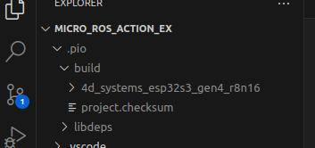
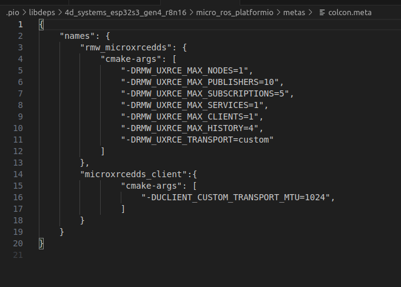
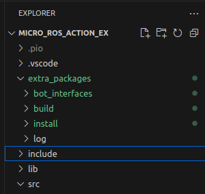
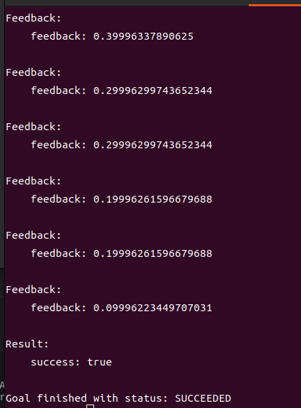

這個範例是給想要使用micro_ros_action的人參考用的
使用單晶片的型號是esp32s3_r8n16
使用前必須得安裝platformIDE
至於該怎安裝可以到 https://fishros.com/d2lros2/#/humble/chapt13/get_started/3.%E6%90%AD%E5%BB%BAPlateFormIO%E5%BC%80%E5%8F%91%E7%8E%AF%E5%A2%83 查看

git clone下來後，使用vscode打開下載好的資料夾，如果有打開自動儲存（或是按下除存）的話會出現.pio資料夾

點開.pio/micro_ros_platformio資料夾下打開metas資料夾點擊colcon.meta

將"-DRMW_UXRCE_MAX_SERVICES=1" 修改成"-DRMW_UXRCE_MAX_SERVICES=3"
補充一下，一個action至少會用到3個服務，由於單晶片性能有限，會在詭異的地方省資源

下一步，刪除.pio/micro_ros_platformio/libmicror 
！！！一定得做，關係到最後一步action的編譯能不能過！！！

接下來可以把.pio資料夾折起來，在最上層資料夾看到extra_packages這個資料夾

打開TERMINAL進入extra_packages這個資料夾下方後，輸入colcon build編譯
最後按下Ctrl+Alt+B讓platformIDE重新編譯

完成後開啟TERMINAL連結上micro_ros_agent 
在開啟另一個TERMINAL輸入
ros2 action send_goal /move_distance bot_interfaces/action/MoveDistance "{goal: 20.0}" --feedback
就能查看有沒有成功了

